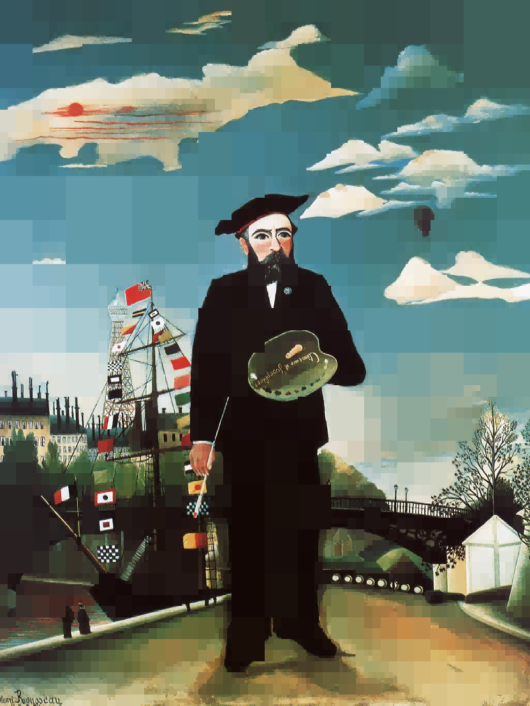
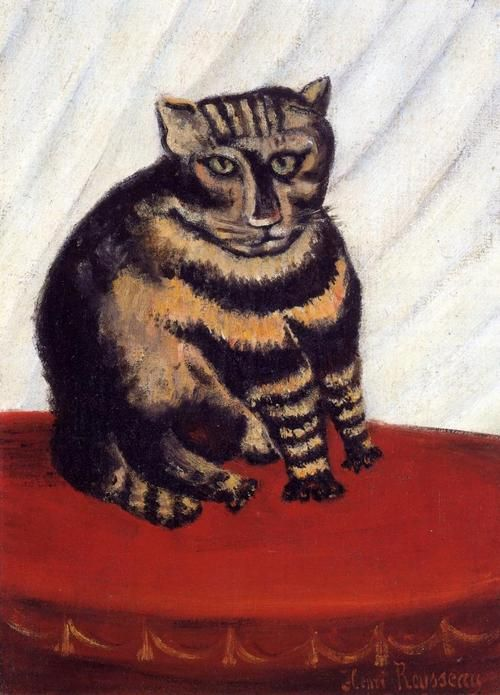
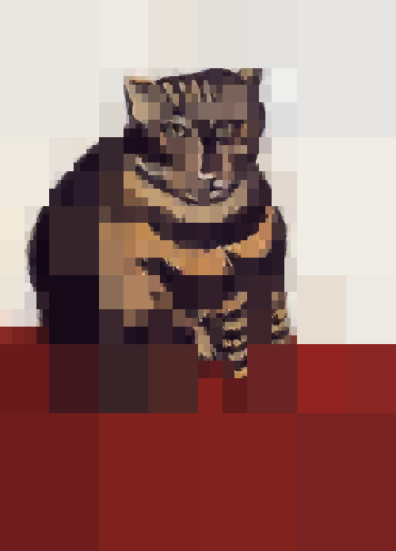

# carre

This is the implementation of a very algorithm for "simplifying" images. The idea is that patches of a single can carry the same visual information with less detail; this results in images that are easier to compress and look a bit like cubism. The algorithm goes as follows:

1. Calculate the average color of the initial image
2. Calculate the average color difference from the average calculated in step 1
3. If the average color difference higher than some threshold, split the image in 4 and apply step 1 to each sub-image
4. If not then color a new blank image with the average color obtained in step 1 and the boundaries of the current image

The algorithm is recursive and deterministic. Lowering the threshold will result in images with more detail, indeed if the threshold is 0 then the algorithm reproduces the original image.

## Installation

1. [Install Go](https://golang.org/doc/install)
2. Make sure that `$GOPATH` is set and that `$GOPATH/bin` has been added to the global path
3. Run `go get -u github.com/MaxHalford/carre`
4. Run `carre -help` to check that the installation was successful

## Examples

```sh
carre -in original/rousseau-1.jpg -out processed/rousseau-1.png -threshold 15
```

Original            |  Processed
:-------------------------:|:-------------------------:
  |  

```sh
carre -in original/rousseau-2.jpg -out processed/rousseau-2.png -threshold 10
```

Original            |  Processed
:-------------------------:|:-------------------------:
  |  

```sh
carre -in original/rousseau-2.jpg -out processed/rousseau-3.png -threshold 30
```

Original            |  Processed
:-------------------------:|:-------------------------:
  |  

## Usage

Run `carre -h` to get a list of available parameters.

## License

The MIT License (MIT). Please see the [license file](LICENSE) for more information.
